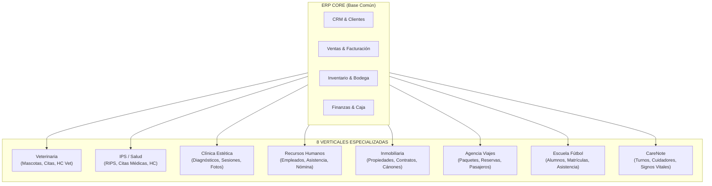

# AUDITORÍA FUNCIONAL INTEGRAL DEL ERP CORE Y SUS 8 VERTICALES

**Fecha:** 26 de Septiembre de 2026  
**Versión:** 1.0.0  
**Estado:** AUDITORÍA COMPLETADA - PENDIENTE DE REVISIÓN Y APROBACIÓN  
**Ámbito:** ERP Core Base + 8 Verticals (`veterinaria-redesign`, `ips`, `clinica-estetica`, `recursos-humanos`, `inmobiliario`, `agencia-viajes`, `escuela-de-futbol`, `carenote`).

---

## 1. INTRODUCCIÓN Y OBJETIVO

El presente documento constituye la auditoría funcional integral del ecosistema ERP, orientada a evaluar la madurez comercial del sistema, identificar brechas transversales (gaps), inconsistencias, duplicaciones y funcionalidades faltantes en el **ERP Core** y en sus **8 verticales especializadas**.

La estrategia del producto se define mediante la ecuación:
$$\text{ERP Core Empresarial} + \text{Funcionalidades Transversales} + \text{Vertical Especializada} + \text{IA} + \text{WhatsApp Omnicanal}$$

---

## 2. INVENTARIO FUNCIONAL ACTUAL POR DOMINIO

### 2.1 ERP Core (Módulo Base Compartido)

| Dominio Funcional | Estado Actual | Componentes y Modelos Existentes | Vacíos o Limitaciones Detectadas |
|---|---|---|---|
| **CRM** | 🟢 Funcional Base | `Client`, `Lead`, `Deal`, `Activity`, `CustomerSegment` | Falta asignación automática de leads (round-robin), webhook nativo multicanal, SLA de atención. |
| **Ventas & Facturación** | 🟡 Parcial | `Invoice`, `InvoiceItem`, `Quote`, `QuoteItem` | Falta soporte nativo para **Notas Crédito / Débito**, devoluciones, pagos parciales estructurados y facturación recurrente en Core. |
| **Compras & Proveedores** | 🟡 Parcial | `Supplier`, `PurchaseOrder`, `PurchaseOrderItem`, `PurchaseReceipt` | Sin Solicitudes de Compra (Requisiciones), falta matching de 3 vías (PO + Recepción + Factura Proveedor) y generación automática de PO por stock mínimo. |
| **Inventario & Almacén** | 🟡 Parcial | `Product`, `Category`, `Brand`, `Unit`, `Warehouse`, `StockMovement`, `StockTransfer`, `StockAlert` | Falta valoración Kardex (PEPS / Promedio Ponderado), Módulo de Toma Física / Ajustes, **Lotes / Vencimientos** (`Batch`/`ExpirationDate`) y Números de Serie. |
| **Finanzas & Tesorería** | 🟡 Parcial | `CashRegister`, `CashSession`, `CashMovement`, `PaymentMethod`, `Payment` | Falta Conciliación Bancaria, modelo de Cuentas Bancarias, Estado de Cuenta CxC / CxP con antigüedad de cartera (30-60-90 días). |
| **Documentación & Reportes** | 🟡 Parcial | Stubs PDF de facturas, exports CSV básicos | Falta diseñador/plantillas avanzadas de PDF institucionales y motor unificado de reportes dinámicos. |
| **Seguridad & Tenancy** | 🟡 Parcial | `User`, `Role`, `Permission`, `AuditLog`, `Company` (Tenancy por header) | Soporta Multi-Empresa (`Company`), pero **carece de Multi-Sucursal / Multi-Sede** (`Branch`/`Location`) dentro de la misma empresa. |
| **Automatización & Notificaciones** | 🔴 Inicial | `ContingencyEvent`, alertas por mail/sistema | Falta motor de reglas dinámicas, webhooks salientes y notificaciones push/WhatsApp en tiempo real. |

---

### 2.2 Inventario por Vertical Especializada

1. **Veterinaria (`veterinaria-redesign`)**
   - **Modelos:** `Patient` (Mascota), `Owner`, `VeterinaryAppointment`, `MedicalRecord`, `VaccinationRecord`, `GroomingService`, `Prescription`.
   - **Fortalezas:** Flujo completo de atención médica animal, control de vacunas y peluquería.
   - **Gaps:** Integración parcial con inventario de medicamentos por lote/vencimiento.

2. **IPS / Salud (`ips`)**
   - **Modelos:** `Doctor`, `Specialty`, `Patient`, `MedicalAppointment`, `ClinicalRecord`, `RipsData`, `ConsentForm`.
   - **Fortalezas:** Historias clínicas, generación de datos RIPS para DIAN/Salud, agendas médicas.
   - **Gaps:** Facturación electrónica en salud requiere integración unificada de copagos y cuotas moderadoras en Finanzas Core.

3. **Clínica Estética (`clinica-estetica`)**
   - **Modelos:** `AestheticPatient`, `FacialAssessment`, `BodyAssessment`, `TreatmentPackage`, `SessionRecord`, `BeforeAfterPhoto`.
   - **Fortalezas:** Paquetes de sesiones, seguimiento fotográfico y valoraciones por zona corporal.
   - **Gaps:** Consumo automático de insumos/productos del inventario por cada sesión ejecutada.

4. **Recursos Humanos (`recursos-humanos`)**
   - **Modelos:** `Employee`, `Department`, `JobPosition`, `AttendanceRecord`, `LeaveRequest`, `PayrollPeriod`.
   - **Fortalezas:** Estructura de personal, control de asistencia y solicitudes de permisos.
   - **Gaps:** Nómina no está integrada con comprobantes de egreso de Tesorería en Core.

5. **Inmobiliaria (`inmobiliario`)**
   - **Modelos:** `Property`, `Owner`, `Tenant`, `LeaseContract`, `RentInstallment`, `PropertyVisits`.
   - **Fortalezas:** Gestión de inmuebles, contratos de arrendamiento y generación de cánones mensuales.
   - **Gaps:** El cobro recurrente de cánones está aislado y no utiliza un motor de facturación recurrente unificado del Core.

6. **Agencia de Viajes (`agencia-viajes`)**
   - **Modelos:** `TravelPackage`, `Destination`, `Booking`, `Passenger`, `FlightDetail`, `HotelReservation`.
   - **Fortalezas:** Reservas de paquetes turísticos, control de pasajeros y vouchers de viaje.
   - **Gaps:** Gestión de cuentas por pagar a proveedores (aerolíneas/hoteles) no vinculada a Compras Core.

7. **Escuela de Fútbol (`escuela-de-futbol`)**
   - **Modelos:** `Student`, `Guardian`, `Category`, `Enrollment`, `MonthlyFee`, `StudentAttendance`, `Coach`.
   - **Fortalezas:** Matrículas, mensualidades (CxC), cartera por cobrar, caja y control de asistencia deportiva.
   - **Gaps:** Mensualidades recurrentes aisladas en lógica propia.

8. **CareNote / Atención Domiciliaria (`carenote`)**
   - **Modelos:** `CarePatient`, `Caregiver`, `ShiftSchedule`, `VitalSignLog`, `CareNoteEntry`.
   - **Fortalezas:** Bitácora de signos vitales, asignación de turnos y reporte diario de cuidadores.
   - **Gaps:** Turnos no liquidados directamente en nómina o facturación por horas prestadas.

---

## 3. IDENTIFICACIÓN DE BRECHAS EMPRESARIALES TRANSVERSALES (GAPS)

Para competir comercialmente con ERPs consolidados en LATAM (ej. Siigo, Alegra, Softland, Defontana), el **ERP Core** requiere subsanar las siguientes 6 brechas estructurales:

### Brecha 1: Gestión de Notas Crédito / Débito y Devoluciones (Ventas)
- **Problema:** En `InvoiceController` solo existen estados de facturación directos. No se contempla la anulación parcial o total mediante **Nota Crédito**, ni ajustes de mayor valor vía **Nota Débito**.
- **Impacto:** Imposibilidad de operar legalmente con facturación electrónica comercial o resolver devoluciones de mercancía.

### Brecha 2: Cuentas por Cobrar (CxC) y Cuentas por Pagar (CxP) Estructuradas con Antigüedad de Cartera (Finanzas)
- **Problema:** El sistema actual registra ventas y compras en estado `pending` o `paid`, pero no existe un módulo para gestionar abonos parciales, vencimientos por cuotas ni reporte de antigüedad de cartera (30, 60, 90, 120+ días).
- **Impacto:** Falta de visibilidad de flujo de caja y gestión de cobros/pagos pendientes.

### Brecha 3: Gestión de Lotes y Fechas de Vencimiento (`Batch` / `Expiration`) (Inventario)
- **Problema:** `Product` y `StockMovement` registran unidades cuantitativas simples. No existe el concepto de lote ni fecha de caducidad por unidad ingresada.
- **Impacto:** Crucial para Veterinaria (medicamentos), IPS (farmacia), Clínica Estética (ampollas/insumos) y Alimentos/Bebidas.

### Brecha 4: Matching de 3 Vías y Requisiciones de Compra (Compras)
- **Problema:** Las órdenes de compra (`PurchaseOrder`) pasan a recepciones (`PurchaseReceipt`) sin validar automáticamente contra la factura final del proveedor o la solicitud inicial (`PurchaseRequisition`).
- **Impacto:** Riesgo de sobrecostos, discrepancias en inventarios recibidos vs. facturados.

### Brecha 5: Motor Unificado de Suscripciones y Facturación Recurrente (Core)
- **Problema:** Escuela de Fútbol (`MonthlyFee`), Inmobiliaria (`RentInstallment`) y contratos de mantenimiento tienen lógica de cobro periódico duplicada en cada módulo.
- **Impacto:** Dificultad para mantener reglas de mora, recargos, intereses o facturación automática recurrente.

### Brecha 6: Estructura Multi-Sucursal / Multi-Sede (`Branch` / `Location`) (Tenancy & Gobernanza)
- **Problema:** La arquitectura resuelve Tenancy mediante `company_id`. Sin embargo, una sola empresa suele tener múltiples sedes o sucursales con cajas e inventarios independientes.
- **Impacto:** No se pueden aislar las operaciones de caja o bodega por sede.

---

## 4. CANDIDATOS DE MIGRACIÓN DE VERTICAL A ERP CORE

Se identificaron 3 componentes desarrollados en las verticales que deben abstraerse y migrarse al **ERP Core** para beneficio de todo el ecosistema:

1. **Motor de Facturación Recurrente y Suscripciones (de Escuela de Fútbol e Inmobiliaria $\rightarrow$ Core `SubscriptionEngine`)**
   - *Razón:* Permitirá contratos recurrentes en cualquier vertical (ej. planes de salud animal en Veterinaria, membresías en Clínica Estética, contratos inmobiliarios, mensualidades académicas).

2. **Módulo de Asistencia / Fichaje / Check-in (de Escuela de Fútbol y RRHH $\rightarrow$ Core `AttendanceEngine`)**
   - *Razón:* Aplicable a empleados (RRHH), alumnos (Escuela de Fútbol), pacientes a citas (Salud/IPS/Vet) y cuidadores (CareNote).

3. **Motor Unificado de Citas y Agendamiento (de IPS y Veterinaria $\rightarrow$ Core `ServiceAppointment`)**
   - *Razón:* Todas las verticales de servicios (IPS, Vet, Estética, Inmobiliaria para visitas, CareNote para turnos) requieren agendamiento, confirmaciones y gestión de disponibilidad de profesionales.

---

## 5. MATRIZ DE PRIORIZACIÓN Y ANÁLISIS DE RIESGOS

| Nivel | Enfoque Principal | Módulos / Funcionalidades | Riesgo de Regresión | Dependencias |
|---|---|---|---|---|
| **P0** | **Comercial Imprescindible** | - CxC & CxP con Antigüedad de Cartera. - Notas Crédito / Débito & Devoluciones. - Lotes y Fechas de Vencimiento en Inventario. - Soporte Multi-Sucursal (`Branch`) en Core. | 🟢 Bajo (Extensiones sobre esquemas existentes) | Reutiliza `Invoice`, `PurchaseOrder`, `Product`, `Company`. |
| **P1** | **Alto Valor Comercial & IA/WhatsApp** | - Motor de Facturación Recurrente (Core). - Agente WhatsApp Omnicanal (Intenciones: Citas, Disponibilidad, Ventas). - Matching de Compras 3 vías. - Conciliación Bancaria manual y por CSV. | 🟡 Medio (Requiere refactorizar cobros recurrentes de verticales) | Depende de P0 (CxC/CxP). |
| **P2** | **Empresarial Avanzado** | - Métodos de Valoración Kardex (Promedio Ponderado / PEPS). - Módulo de Toma Física de Inventarios y Ajustes. - Asignación automática de Leads CRM & SLA. - Trazabilidad por Números de Serie. | 🟡 Medio (Impacta cálculo de costos de ventas) | Depende de P0 (Lotes/Bodegas). |
| **P3** | **Escala & Inteligencia** | - Previsiones de demanda de inventario con IA. - Analítica predictiva de morosidad en cartera. - Integración con pasarelas de pago y DIAN en lote. | 🟢 Bajo (Módulos analíticos aislados) | Depende de P1 y P2. |

---

## 6. CONCLUSIÓN DE AUDITORÍA

El ERP posee una base sólida y 8 verticales funcionales con alto valor de dominio. Implementando las adiciones del nivel **P0** y **P1**, el sistema alcanzará la madurez comercial necesaria para competir y comercializarse en el mercado empresarial.

**Próximo paso recomendado:** Revisión y aprobación por parte del usuario para proceder a la Fase 1 (Implementación de P0 en Core).
