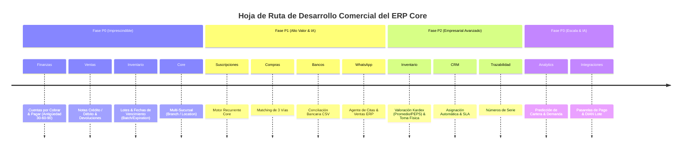

# HOJA DE RUTA Y PLAN DE IMPLEMENTACIÓN FUNCIONAL DEL ERP CORE

**Fecha:** 26 de Septiembre de 2026  
**Versión:** 1.0.0  
**Estado:** PROPUESTA DE HOJA DE RUTA DE IMPLEMENTACIÓN  
**Objetivo:** Guiar el desarrollo por fases de las funcionalidades empresariales transversales del ERP Core sin romper la compatibilidad con las 8 verticales existentes.

---

## 1. RESUMEN EJECUTIVO DE LA HOJA DE RUTA

La hoja de ruta está estructurada en 4 Fases de Prioridad (P0 a P3), diseñadas para transformar la arquitectura actual en una plataforma comercial robusta.



---

## 2. PLAN DETALLADO POR FASES

### FASE P0: COMERCIAL IMPRESCINDIBLE (Core Finanzas, Ventas & Inventario Esencial)

#### P0.1 - Cuentas por Cobrar (CxC) y Cuentas por Pagar (CxP) Estructuradas
- **Objetivo:** Permitir el control detallado de la deuda de clientes y pagos a proveedores con cuotas, vencimientos y edades de cartera.
- **Modelos BD:**
  - `AccountReceivable` (`invoice_id`, `client_id`, `total_amount`, `paid_amount`, `due_date`, `status`)
  - `AccountPayable` (`purchase_order_id`, `supplier_id`, `total_amount`, `paid_amount`, `due_date`, `status`)
  - `PaymentSchedule` (`schedule_type`, `installment_number`, `due_date`, `amount`, `status`)
- **Endpoints:**
  - `GET /api/v1/finance/aging-report` (Reporte de cartera 30-60-90-120+ días).
  - `POST /api/v1/finance/receivables/{id}/payments` (Registro de abonos parciales).
- **Integración con Verticales:** La Escuela de Fútbol, Inmobiliaria, Veterinaria e IPS registrarán automáticamente sus cuentas por cobrar en este módulo unificado.

#### P0.2 - Notas Crédito, Notas Débito y Devoluciones
- **Objetivo:** Permitir anulaciones, ajustes de precio y devoluciones parciales de facturas registradas.
- **Modelos BD:**
  - `CreditNote` (`invoice_id`, `code`, `reason`, `subtotal`, `tax`, `total`, `status`)
  - `CreditNoteItem` (`credit_note_id`, `product_id`, `quantity`, `unit_price`, `total`)
  - `DebitNote` (`invoice_id`, `code`, `reason`, `total`)
- **Endpoints:**
  - `POST /api/v1/sales/invoices/{id}/credit-notes`
  - `POST /api/v1/sales/invoices/{id}/debit-notes`
- **Impacto en Inventario:** La emisión de una Nota Crédito por devolución reingresa automáticamente las unidades al `Warehouse` mediante un `StockMovement` de tipo `RETURN`.

#### P0.3 - Lotes y Fechas de Vencimiento (`Batch` & `ExpirationDate`)
- **Objetivo:** Controlar el vencimiento de medicamentos e insumos sensibles.
- **Modelos BD:**
  - `ProductBatch` (`product_id`, `warehouse_id`, `batch_number`, `expiration_date`, `current_quantity`, `status`)
- **Modificación a Modelos Existentes:**
  - `StockMovement` $\rightarrow$ agregar `product_batch_id` opcional.
  - `InvoiceItem` y `PurchaseOrderItem` $\rightarrow$ agregar `product_batch_id`.
- **Integración con Verticales:** Veterinaria, IPS y Clínica Estética asignarán lotes al prescribir o consumir insumos.

#### P0.4 - Soporte Multi-Sucursal (`Branch` / `Location`)
- **Objetivo:** Permitir a empresas gestionar múltiples puntos de atención o sedes físicas.
- **Modelos BD:**
  - `Branch` (`company_id`, `name`, `code`, `address`, `phone`, `status`)
- **Impacto:** Vincular `Warehouse`, `CashRegister`, `User` y `Invoice` a `branch_id`.

---

### FASE P1: ALTO VALOR COMERCIAL & AUTOMATIZACIÓN (Suscripciones, Compras 3-Vías, Bancos & WhatsApp)

#### P1.1 - Motor Unificado de Suscripciones y Facturación Recurrente
- **Objetivo:** Unificar la lógica de cobro periódico de Escuela de Fútbol (`MonthlyFee`), Inmobiliaria (`RentInstallment`) y contratos de mantenimiento en el Core.
- **Modelos BD:**
  - `SubscriptionPlan` (`name`, `billing_cycle` [monthly, quarterly, annual], `price`, `auto_renew`)
  - `Subscription` (`client_id`, `subscription_plan_id`, `start_date`, `next_billing_date`, `status`)
- **Automatización:** Comando programado (`php artisan subscriptions:process-billing`) que genera automáticamente las facturas/cuentas por cobrar al cumplir la fecha del ciclo.

#### P1.2 - Matching de Compras de 3 Vías
- **Objetivo:** Garantizar que no se paguen facturas de proveedores que no coincidan con la Orden de Compra y la Recepción Física en Almacén.
- **Flujo:** `PurchaseRequisition` $\rightarrow$ `PurchaseOrder` $\rightarrow$ `PurchaseReceipt` $\rightarrow$ Validation Matching $\rightarrow$ `AccountPayable`.

#### P1.3 - Conciliación Bancaria Manual y por CSV
- **Objetivo:** Cargar extractos bancarios (formato CSV/OFX) y cruzarlos automáticamente contra los movimientos de caja/banco registrados en el ERP.

#### P1.4 - Agente WhatsApp Omnicanal (Core Integración)
- **Objetivo:** Exponer un webhook estandarizado y motor de intenciones para atención automática por WhatsApp en cualquier vertical.
- **Intenciones Soportadas:**
  1. Consulta de disponibilidad y agendamiento de citas.
  2. Consulta de estado de cuenta / facturas pendientes.
  3. Solicitud de información de servicios / productos.
  4. Registro de prospectos (Leads) directos al CRM Core.

---

### FASE P2: EMPRESARIAL AVANZADO (Kardex Valoración, Ajustes & SLA CRM)

#### P2.1 - Métodos de Valoración Kardex (Promedio Ponderado y PEPS)
- **Objetivo:** Calcular con precisión matemática el costo de mercancía vendida (COGS) e inventario final.

#### P2.2 - Módulo de Toma Física de Inventarios y Ajustes
- **Objetivo:** Permitir conteos físicos periódicos en bodega y generar registros de ajuste de inventario por merma, rotura o descuadre.

#### P2.3 - Motor de Asignación Automática de CRM & SLA
- **Objetivo:** Asignar leads por regla Round-Robin entre vendedores y medir tiempos de primera respuesta (SLA).

---

### FASE P3: ESCALA & INTELIGENCIA (Predicción & Analítica Avanzada)

- Previsiones de demanda de inventario con modelos de aprendizaje automático.
- Analítica predictiva de riesgo de cartera mora.
- Integración nativa directa con pasarelas de pago (Stripe, Wompi, MercadoPago) para auto-cobro de facturas.

---

## 3. ARQUITECTURA DE INTEGRACIÓN Y COMPATIBILIDAD

Para garantizar cero regresión en las 8 verticales existentes:

```
+-----------------------------------------------------------------------+
|                            VERTICALES ERP                             |
| (Vet, IPS, Estética, RRHH, Inmobiliaria, Viajes, Fútbol, CareNote)    |
+-----------------------------------------------------------------------+
                                   |
                                   v (Usan interfaces unificadas)
+-----------------------------------------------------------------------+
|                          ERP CORE SERVICES                            |
| +---------------------+ +--------------------+ +--------------------+ |
| |  AccountsReceivable | | SubscriptionEngine | | AppointmentEngine  | |
| +---------------------+ +--------------------+ +--------------------+ |
| +---------------------+ +--------------------+ +--------------------+ |
| |   CreditNoteEngine  | | ProductBatchEngine | |   BranchResolver   | |
| +---------------------+ +--------------------+ +--------------------+ |
+-----------------------------------------------------------------------+
                                   |
                                   v (Operaciones atómicas & auditadas)
+-----------------------------------------------------------------------+
|                    BASE DE DATOS ERP CORE (MySQL/PostgreSQL)          |
+-----------------------------------------------------------------------+
```

1. **Patrón Servicio / Fachada:** Las nuevas entidades (`AccountReceivable`, `CreditNote`, `ProductBatch`) se gestionarán mediante Servicios de Dominio en `app/Services/Core/`.
2. **Eventos de Dominio:** Cuando una vertical genera una venta o cita, dispara un evento (`InvoiceCreated`, `AppointmentScheduled`) que los oyentes del Core procesan sin acoplar código vertical al Core.
3. **Control de Versiones y Migraciones:** Todas las migraciones serán aditivas (columnas `nullable` o relaciones opcionales) para no romper seeders ni tests existentes.

---

## 4. CRITERIOS DE ACEPTACIÓN Y PRUEBAS OBLIGATORIAS POR FASE

Cada fase de desarrollo requerirá cumplir estrictamente:
- **Backend Tests (PHPUnit):** 100% de los tests existentes pasando + nuevos unitarios para los servicios Core.
- **Frontend Tests / Build:** Compilación limpia de Next.js (`npm run build`) con 0 errores de ESLint/TypeScript.
- **Auditoría de Regresión:** Verificación de que las 8 verticales siguen funcionando de extremo a extremo.
